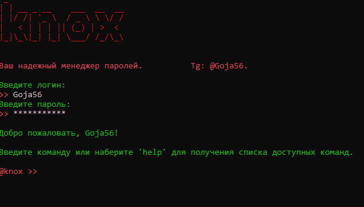

==Knox==         v1.0                       [RU Version]

Knox - это защищенный автономный менеджер паролей, созданный на основе Python и шифрования Fernet.Ваши пароли никогда не покинут ваше устройство. Knox идеально подходит для пользователей, ориентированных на конфиденциальность и желающих получить полный контроль над своей конфиденциальной информацией - без облака, без отслеживания и без серверов.

##Demo

Knox использует симметричное шифрование класса Fernet, для хранения ваших данные. Все ваши записи хранятся в файле knox_data\vault.json  в зашифрованном виде. 
Ключ шифрования, с помощью которого вы можете работать со своим хранилищем, тоже не хранится в открытом виде, он шифруется с помощью матер ключа, который создается на основе вашего пароля(для авторизации в Knox) и соли(случайного значения, которое создается при регистрации). Каждый раз когда вы будете работать с хранилищем, knox будет создавать этот мастер ключ заново и расшифровывать ключ от хранилища, тем самым ключ в незашифрованном виде хранится только в памяти программы в момент выполнения команд. 

Для работы knox не требует подключения к интернету, за одним исключением: когда тот проводит проверку пароля на утечку, перед добавлением его в хранилище. Knox проверяет пароль на утечку через сервис haveibeenpwned(можете ознакомится подробнее https://haveibeenpwned.com/API/v3#PwnedPasswords).
 -Как это работает:
     Ваш пароль хешируется и разбивается на суффикс(1-ые 5 символов) и префикс(остальные символы).
     Суффикс отправляется в haveibeenpwned.
     Если в их базе найдены совпадения по суффиксам, сервис присылает полные пароли(суффикс+префикс).
     В ответе knox уже сверяет ваш полный пароль с полученными от haveibeenpwned.
     Если совпадения найдены knox предупредит вас об этом. 
Таким образом knox сохраняет ваш пароль в надежности и даже если запрос будет перехвачен, злоумышленник не сможет узнать что за пароль вы отправляли к сервису API. 
Вы можете игнорировать эту проверку или отключить ее вовсе.

Ваши данные для авторизации в knox также не хранятся в открытом виде, knox хранит только хеши ваших паролей в файле knox_data\users.json. Там же хранится и созданная соль в зашифрованном виде.

==Команды для работы в knox==   Команды в которых происходит взаимодействия с хранилищем, требуют ввода пароля.

  -noxadd - позволяет добавлять записи в хранилище в виде site:gmail.com, login:***, password:***. При добавлении пароля будут произведены две проверки: 
        1. Локальная проверка на надежность пароля.
        2. Проверка пароля на утечку(описано выше).
  -noxshow - выводит содержимое хранилища в консоль(расшифровывает хранилище) 
  -noxmodify - позволяет изменить сохраненную запись(login или password).
  -noxdel - удалить запись по названию сайта(удаляется полная запись с логином и паролем).
  -noxdel_vault - удаляет все сохраненные записи в вашем хранилище.
  -noxdel_profile - удаляет существующий профиль пользователя(программа завершится и потребуется повторная регистрация).
       Вместе с вашим профилем удаляются все ваши сохраненные данные!
  -noxcheck_pass - позволяет проверить пароль на утечку вручную.
  -noxgenerate - позволяет сгенерировать n кол-во паролей и сохранить их в запись к сайту.
  -noxst_change - позволяет отключить работу некоторых сервисов.
       В noxadd описаны проверки, которые осуществляются для проверки пароля на надежность.
       Вы можете отключить эти проверки введя данную команду и задав новый статус для сервисов pwned_check и reliability_check. Текущие сервисные статусы хранятся в          knox_data\sys_status.json 
  -noxdel_pass - позволяет задать пароль для удаления.
       Может случится такое что вас вынудят раскрыть свой пароль для доступа к knox, тем самым злоумышленник получит доступ ко всем вашим данным. Чтобы не раскрывать          свой настоящий пароль вы можете задать пароль для удаления, который можно раскрыть третьим лицам. При его вводе пользователь сможет войти в программу но                хранилище будет очищено. Если вдруг что-то пойдет не так и хранилище не сможет быть очищено knox удалит ключ шифрования от хранилища, следовательно сохраненные         данные уже не получится расшифровать.  
       Пароль для удаления хранится там же где и основной, под ключом dconf. 
       Советую вручную делать копии ваших паролей и вашего ключа шифрования, чтобы не потерять все данные в экстренной ситуации.
  -noxkey - расшифровывает ваш ключ от хранилища и выводит его в консоль. 

Как вы могли понять ключ ко всему это ваш пароль для авторизации в knox. Позаботьтесь о том чтобы он был надежным, лучшее место для его хранения - это ваша память.)
Приятного пользования! 

## Как запустить:
\start\knox.exex

==Обратная связь==

Буду рад вашим отзывам!  
Что бы вы хотели добавить, изменить, улучшить?  
Закрывает ли Knox ваши потребности?

Мой Telegram — указан в заголовке программы.  
Оставляйте комментарии на странице проекта на GitHub.  
Спасибо, что пользуетесь Knox!

────────────────────────────────────────────────────

==Knox==         v1.0                            [EN Version]

Knox - secure offline password manager built with Python and Fernet encryption.Your passwords never leave your device. Knox is ideal for privacy-focused users who want full control over their sensitive information — with no cloud, no tracking, and no servers.

Knox uses symmetric Fernet-class encryption to store your data. All your records are kept in the knox_data/vault.json file in an encrypted form.
The encryption key, which you use to work with your vault, is also not stored in plain text; it is encrypted with a master key created based on your password (for Knox authorization) and a salt (a random value generated during registration). Each time you work with the vault, Knox will regenerate this master key and decrypt the vault key, meaning the key remains unencrypted only in the program's memory during command execution.

Knox does not require an internet connection, with one exception: when it checks a password for a leak before adding it to the vault. Knox checks the password for leaks via the haveibeenpwned service (you can learn more at https://haveibeenpwned.com/API/v3#PwnedPasswords).

 -How it works:
     Your password is hashed and split into a suffix (first 5 characters) and a prefix (remaining characters).
     The suffix is sent to haveibeenpwned.
     If matches are found for the suffix, the service returns full passwords (suffix + prefix).
     Knox then compares your full password with the received data from haveibeenpwned.
     If a match is found, Knox will warn you.
     This way, Knox keeps your password secure; even if the request is intercepted, an attacker cannot determine which password you sent to the API service.
     You can ignore this check or disable it entirely.
Your Knox authorization data is also not stored in plain text; Knox stores only the hashes of your passwords in the knox_data/users.json file. The generated salt      is also stored there in an encrypted form.

==Commands for Working with Knox==

Commands that interact with the vault require entering your password.

-noxadd - Allows you to add records to the vault in the format site:gmail.com, login:***, password:***. When adding a password, two checks are performed:
       Local password reliability check.
       Password leak check (described above).
-noxshow - Displays the vault contents in the console (decrypts the vault).
-noxmodify - Allows you to modify a saved record (login or password).
-noxdel - Deletes a record by site name (removes the full record with login and password).
-noxdel_vault - Deletes all saved records in your vault.
-noxdel_profile - Deletes the existing user profile (the program will terminate, and re-registration will be required).
       All your saved data will be deleted along with your profile!
-noxcheck_pass - Allows you to manually check a password for a leak.
-noxgenerate - Allows you to generate a specified number of passwords and save them to a site record.
-noxst_change - Allows you to disable certain services.
       In noxadd, the checks performed to assess password reliability are described.
       You can disable these checks by using this command and setting a new status for the pwned_check and reliability_check services. Current service statuses are        stored in knox_data/sys_status.json.
-noxdel_pass - Allows you to set a deletion password.
       It might happen that you are forced to reveal your Knox password, giving an attacker access to all your data. To avoid revealing your real password, you can set        a deletion password that can be disclosed to third parties. When entered, the user can log in, but the vault will be wiped. If something goes wrong and the        vault cannot be cleared, Knox will delete the vault encryption key, making the saved data unrecoverable.
       The deletion password is stored in the same place as the main password, under the dconf key.
       It’s recommended to manually back up your passwords and encryption key to avoid data loss in an emergency.
-noxkey - Decrypts your vault key and displays it in the console.
       As you may have gathered, the key to everything is your Knox authorization password. Make sure it’s strong—the best place to store it is your memory!

Enjoy using Knox!

## How to Run:
\start\knox.exex

==Feedback==

I’d love to hear your feedback!
What would you like to add, change, or improve?
Did you feel that Knox solves your needs?

My Telegram — listed in the program header.
Leave comments on the project page on GitHub.

Thank you for using Knox!